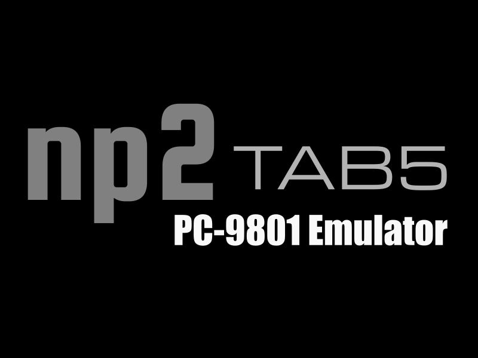

# np2 TAB5



A PC-9801 emulator for the **M5Stack Tab5**.

It is a fork of **np2 espresso**, the ESP32-S3 PC-9801 emulator, which is itself
based on **np2kai** — the PC-9801 emulator developed by AZO234.

日本語: [README.jp.md](README.jp.md)

---

## 1. Features

### Compatible ROMs built in

A simple BIOS written for this project, and a public-domain font, are built into
the firmware. **It boots from a blank microSD card — no ROM dump from real
hardware is needed.**

### USB keyboard and mouse

**A USB keyboard and a USB mouse cannot be used at the same time**, because
ESP-IDF does not support it.

### Bluetooth keyboard and mouse

BLE only. Devices that require a passcode to pair are not supported.

### Touch panel as a mouse

The touch panel acts as the PC-98 mouse.

### Screenshots

Saves the screen to the microSD card as a PNG.

### SD Card Reader mode

Presents the Tab5's microSD card to a PC as a drive. The transfer rate is about
0.6MB/s, which is very slow.

### Disk Image Reader mode

Presents the currently mounted hard disk image to a PC as a drive. The transfer
rate is about 0.6MB/s, which is very slow.

### GreaseWeazle mode

Mounts the disk sitting in a real drive, through a GreaseWeazle plugged into the
Tab5's USB-A port. See
[GreaseWeazle mode](#greaseweazle-mode-1) under *Running it* for the details.

---

## 2. Building

### (1) Build

A plain ESP-IDF project — no Arduino core, no PlatformIO.

**Requires ESP-IDF v5.5. It will not build on v6.x.**

```sh
git clone https://github.com/<you>/np2_TAB5.git
cd np2_TAB5
. $HOME/esp/esp-idf/export.sh     # wherever your IDF v5.5 lives
idf.py build
```

There is no `idf.py set-target` step: the target is already set in
`sdkconfig.defaults`. The first build downloads the managed components at the
versions pinned in `dependencies.lock`, which takes a few minutes.

`./build.sh` does the same and finds ESP-IDF for you.

### (2) Flashing

```sh
idf.py -p <PORT> flash monitor
```

`<PORT>` is `/dev/ttyACM0` on Linux, `/dev/cu.usbmodem*` on macOS, `COMn` on
Windows — the Tab5's USB-C socket appears as a USB-Serial-JTAG device. Leave the
monitor with `Ctrl-]`. `./flash.sh [PORT]` is the same thing.

#### Without a toolchain

Pre-built binaries are in [`bin/`](bin/), and the single merged image is in
[`firmware/`](firmware/) (its odd file name is the naming convention M5Burner
expects).

Either write the merged image, which is the whole flash — bootloader, partition
table and application:

```sh
esptool --chip esp32p4 -p <PORT> write-flash 0x0 firmware/np2_TAB5_0x0.bin
```

or the four parts:

```sh
esptool --chip esp32p4 -p <PORT> -b 921600 write-flash \
    --flash-mode qio --flash-freq 80m --flash-size 16MB \
    0x2000  bootloader.bin \
    0x8000  partition-table.bin \
    0xe000  ota_data_initial.bin \
    0x10000 np2_espresso.bin
```

**Write the bootloader too, in `qio` mode.** From a `dio`-mode bootloader the
emulator is measurably slower.

#### Settings survive a reflash

Disk selection, CPU clock, backlight, volume and Bluetooth pairings live in NVS,
which flashing does not touch. To start from nothing:

```sh
esptool --chip esp32p4 -p <PORT> erase-flash    # then write as above
```

To clear only the settings and keep the firmware:

```sh
esptool --chip esp32p4 -p <PORT> erase-region 0x9000 0x5000
```

---

## 3. Running it

Put a disk image (`.NFD`, `.NHD` and others) in the root of a microSD card
formatted as FAT32, insert it into the Tab5 and switch on: the built-in
compatible BIOS starts.

**F11, F12 or Pause** opens the built-in menu.

Choose disk images for FDD1 / FDD2 / HDD, then leave the menu with **RESET**: the
machine reboots with those images mounted.

If you have a `BIOS.ROM` or `FONT.ROM` dumped from real hardware, put it in the
root of the microSD card and select it from the menu. It takes precedence over
the built-in ROMs.

### Connecting Bluetooth devices

The Tab5 keeps listening until both a keyboard and a mouse are connected. **There
is no time limit.**

- Switch a device on at any time — during boot or long afterwards — and it
  connects within about a second.
- A device that has gone to sleep has to be woken: press a key, or move the
  mouse.
- Once a keyboard and a mouse are both connected, scanning stops.

### GreaseWeazle mode

Mounts the disk sitting in a real drive directly, through a GreaseWeazle plugged
into the Tab5's USB-A port. To use it, mount the GreaseWeazle on FDD1 or FDD2
from the menu.

- Up to two GreaseWeazles can be connected. For that, use a **self-powered USB
  hub**.
- **Power the drives separately.** A 5-inch drive needs its own supply.
- After changing a disk, eject it from the menu once and mount it again.
- **Copy-protected disks are not supported.**

Set the jumpers on a drive connected to a GreaseWeazle as below. Where there is
more than one drive, set them all the same.

```
DX:1
MON:1
USE:2
RD:1
HDE:1
DEN:1
```

---

## 4. Notes

- As of the latest builds, the M5Stack Tab5 ships with one of three display
  controllers: **ILI9881C (ver.1), ST7123 (ver.2) or ST7121 (ver.3)**. The
  ILI9881C (ver.1) is **not supported**, as it could not be tested on real
  hardware.
- Everything MIDI has been omitted from the np2kai base: it did not fit in RAM.

---

## 5. Licence

The code specific to this project, including the built-in compatible BIOS, is
under the **MIT licence**.

The libraries and sources it is built from each have their own licences. See
**[LICENSE.md](LICENSE.md)** for the full statement, or
**[LICENSE.jp.md](LICENSE.jp.md)** for a Japanese translation.

---

Copyright 2026 mochimochi-man / Uh — X: [@calorie0](https://x.com/calorie0)
